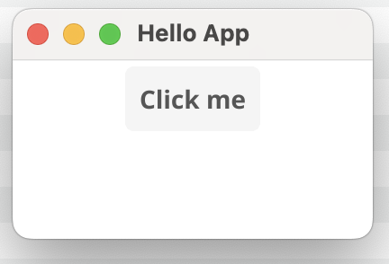
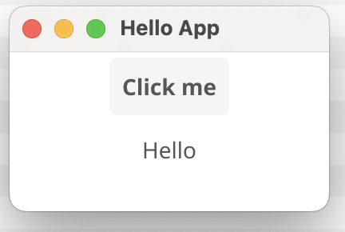

# Fyne Hello App

A simple Fyne application that demonstrates basic GUI functionality with a button and label.

## Description

This is a minimal example of a Fyne GUI application that showcases:
- Basic window creation and management
- Button widget implementation
- Label widget with dynamic content
- Event handling for button clicks
- Layout management using containers
- Modern Material Design-inspired UI

The application serves as a starting point for learning Fyne toolkit and can be used as a template for building more complex desktop applications.

## Screenshots

### Initial State


### After Click


## Prerequisites

- Go 1.24 or later
- Fyne dependencies (will be installed automatically)

## Installation

1. Clone the repository:
```bash
git clone https://github.com/romanitalian/fyne-hello.git
cd fyne-hello
```

2. Install dependencies:
```bash
go mod tidy
```

## Running the Application

To run the application:

```bash
go run main.go
```

## Features

- Displays a window with a centered button
- Clicking the button shows "Hello" text below it
- Modern and clean UI using Fyne toolkit

## Building for Distribution

To build the application for your platform:

```bash
go build
```

For more information about building and packaging Fyne applications, visit the [official Fyne documentation](https://docs.fyne.io/started/distribution.html). 
